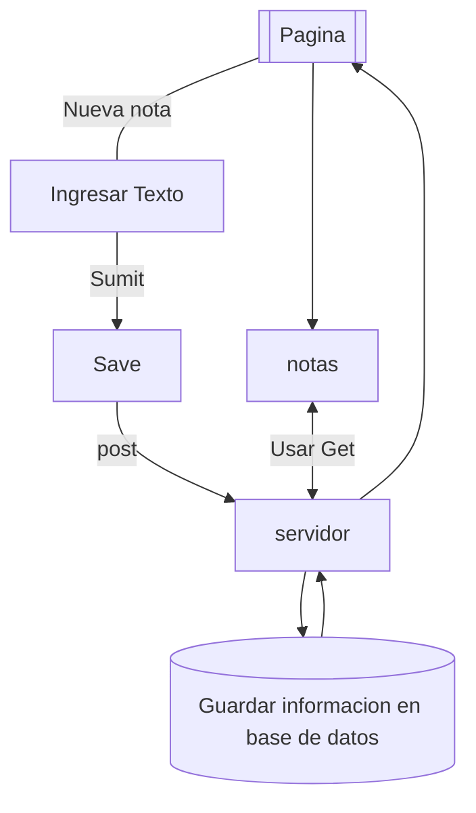

# Diagrama nota

```mermaid
graph TD;
  pagina[["Pagina"]]--"Nueva nota" --- input
  input["Ingresar Texto"]--"Sumit"--> Save
  Save --"post" --> servidor
  servidor --> baseDatos[("Guardar informacion en base de datos")]
  baseDatos --> servidor
  servidor --> pagina
  notas <--"Usar Get"--> servidor
  pagina--->notas
```